<!-- Terminal-style profile based on the supplied README template. -->

<h3><code>SakshamGadade06@github ~ $ whoami</code></h3>

<table>
<tr>
<td valign="top"></td>
<td valign="top"></td>
</tr>
</table>

 
 

<h3><code>SakshamGadade06@github ~ $ ./contributions.sh</code></h3>

 
 

<h3><code>SakshamGadade06@github ~ $ ./about.sh</code></h3>

<b>Engineering Student · AI/ML · Computer Vision</b>

Building practical projects around machine learning, image processing, and lunar image registration.

 

Profile artwork is generated from files in this repository. The contribution graphic is refreshed automatically by GitHub Actions.

